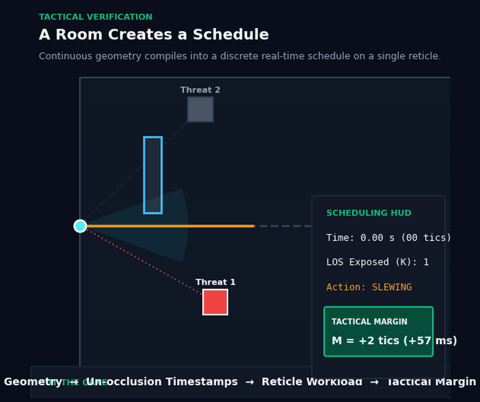
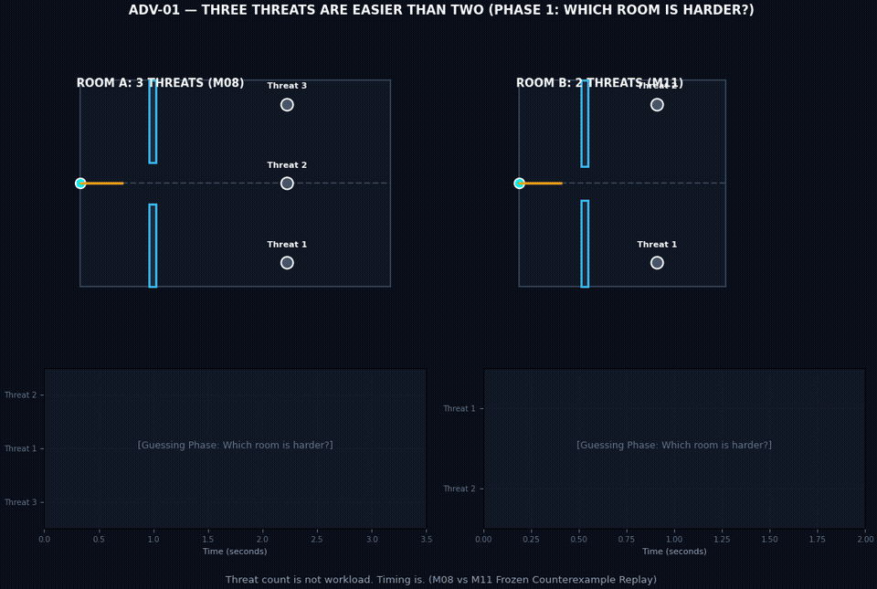
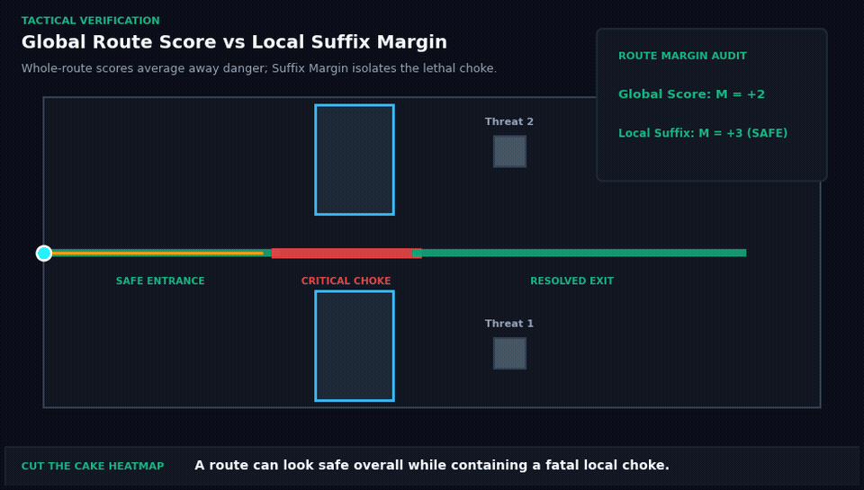
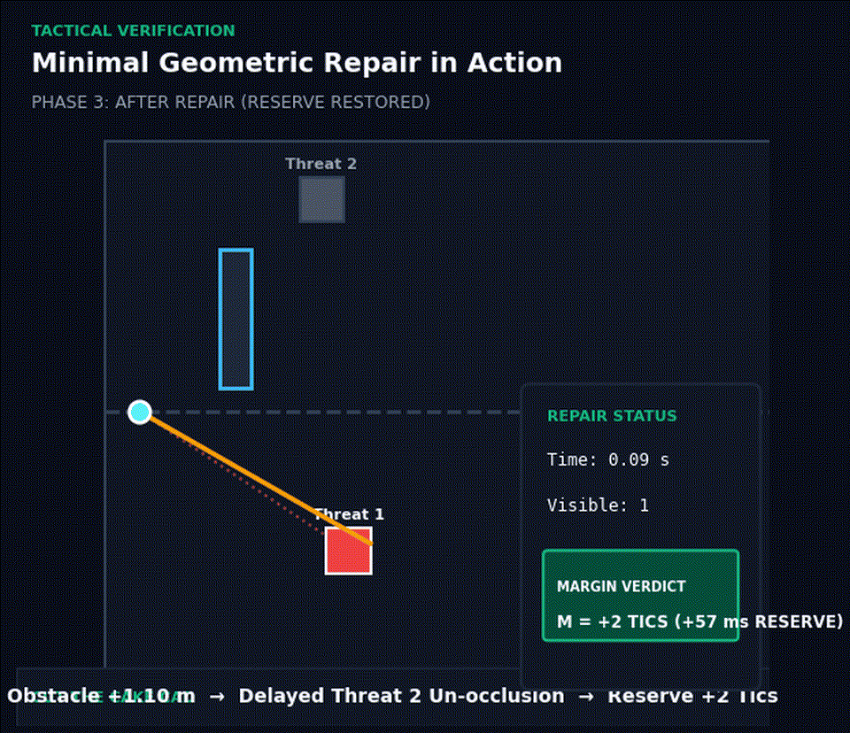
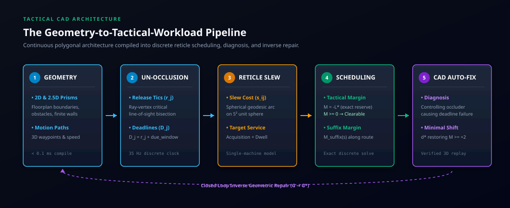

# Cut the Cake 🍰

**A map doesn't just decide what you can see. It decides when information reaches you.**

*Cut the Cake is a research prototype that treats a player's field of view as a stream of time-sensitive tasks and asks whether the geometry gives one person enough time to process them.*

[](https://opensource.org/licenses/MIT)
[](https://www.python.org/downloads/)
[]()
[](ROADMAP.md)

<p align="center">
  
</p>

---

## 🎯 Choose Your Path

| Who You Are | What You Need | Where to Start |
| :--- | :--- | :--- |
| **Non-Gamer / General Adult** | A 5-minute explanation of the core idea using an alarm/deadline analogy. | [**docs/ONE_PAGE_OVERVIEW.md**](docs/ONE_PAGE_OVERVIEW.md) |
| **Game & Level Designer** | How to lint sightlines, fix crossfires, and use the Tactical CAD workbench. | [**docs/WHAT_WE_DISCOVERED.md**](docs/WHAT_WE_DISCOVERED.md) & [**docs/PRACTICAL_APPLICATION_GUIDE.md**](docs/PRACTICAL_APPLICATION_GUIDE.md) |
| **Researcher / Academic** | Theoretical foundations, proofs, evidence ladder, and verified limits. | [**docs/EVIDENCE_AND_LIMITS.md**](docs/EVIDENCE_AND_LIMITS.md) & [**paper/manuscript.md**](paper/manuscript.md) |
| **Software Engineer** | Architecture, schemas, CLI tools, and reproduction scripts. | [**Quickstart Below**](#quickstart--installation) & [**ROADMAP.md**](ROADMAP.md) |
| **Competitive Player** | Corner distance, clearing order, and pre-aiming intuition. | [**Interactive Explainer**](explainer/index.html) & [**docs/MODEL_DERIVED_PLAYER_INTUITIONS.md**](docs/MODEL_DERIVED_PLAYER_INTUITIONS.md) |

*(See [**docs/START_HERE.md**](docs/START_HERE.md) for the complete navigation guide.)*

---

## 💡 Three Core Discoveries

### 1. Seeing fewer threats does not mean a space is easier
Two rooms can expose different numbers of hostile angles and produce the opposite of what intuition expects. In our frozen counterexample benchmark, **Room A** exposes **3 simultaneous enemies** with generous 3.0s reaction budgets and is **100% solvable** ($\mathcal{M} = +65\text{ tics}$), while **Room B** exposes only **2 enemies** with tight 0.30s deadlines and creates an unavoidable **deadline overload** ($\mathcal{M} = -29\text{ tics}$).

<p align="center">
  
</p>

### 2. A route can look safe overall while hiding a fatal local choke
A whole-route optimum answers a different question from an approach-interval suffix calculation: an aggressive route may appear globally feasible over an entire traversal while harboring an unserviceable multi-angle crossfire at a local doorway. This led to **Suffix Tactical Margin ($\mathcal{M}_{\text{suffix}}$)**, evaluating remaining schedulability from any spatial point along the path to the goal.

<p align="center">
  
</p>

### 3. Continuous geometry changes cross discrete timing boundaries
The simulation operates on a 35-Hz clock. Translating an obstacle by **$1.10\,\text{m}$** can delay an un-occlusion by 8 tics, turning a lethal 6-tic deficit ($\mathcal{M} = -6$) into a 2-tic reserve ($\mathcal{M} = +2$). Conversely, continuous angular shifts that stay within the same aim-tic bucket produce zero discrete tactical difference.

<p align="center">
  
</p>

---

## ⚙️ How the System Works

Cut the Cake models the player's single aiming reticle as a **stateful single-machine processor** and compiles geometry into a real-time scheduling problem:

<p align="center">
  
</p>

```text
  GEOMETRY (2D / 2.5D Floorplan)
     │
     ▼
  INFORMATION RELEASE (r_j: Un-occlusion timestamps along path)
     │
     ▼
  ATTENTION / RETICLE WORKLOAD (s_ij: S^2 great-circle slew cost + p_j: Service dwell)
     │
     ▼
  DEADLINE FEASIBILITY (D_j: Enemy reaction budgets → Tactical Margin M = -L*)
     │
     ▼
  DIAGNOSIS (Identify controlling occluder causing deadline breach)
     │
     ▼
  INVERSE REPAIR (Synthesize minimal obstacle shift d* restoring M >= +2 tics)
     │
     ▼
  3D CONTROLLER EXECUTION / REPLAY (Deterministic S^2 Slerp verification)
```

---

## 📊 Scientific Evidence at a Glance

<p align="center">
  
</p>

| Evidence Tier | Benchmark Scope | Status & Evidence Summary |
| :--- | :--- | :--- |
| **Formal Model** | Exact single-machine scheduling ($1 \mid r_j, s_{ij} \mid L_{\max}$) | **Proven**: Min-plus dioid algebra composition ($C \equiv D$ theorem) |
| **PCG Sweeps** | 25,000 candidate procedural dungeon assemblies | **Verified within Model**: **0 false certificates** at compile time ($< 0.1\,\text{ms}$ per room) |
| **Simulation** | 9,000 discrete 35-Hz clearing episodes across 60 arenas | **Validated in Controlled Simulation**: Tactical Margin achieves **$\text{ROC-AUC} = 1.0000$** (+19% over static counts) |
| **Engine Transfer** | 50 unserviceable arenas in native C++ Doom (*ViZDoom*) | **External-Engine Transfer Evidence**: **80%** source repair success, **75%** engine transfer efficiency |
| **Real-Map Grayboxes** | Dust II (A-Long & B-Tunnels), Ascent (Wine), Transit 213 | **Mechanism Transfer Evidence**: Pre-registered mechanism validation; confirmed model refusal on dry chokes |
| **Horizon 6 2.5D** | Extruded prisms, $S^2$ spherical aiming, 3D controller execution | **Verified within Model**: **138/138 acceptance tests passed**; realized event parity $t_j^{\text{event}} \equiv C_j - 1$ |

### ⚠️ What This Does Not Prove
- **Not yet calibrated on human populations:** Real human players have varying motor skills, anticipation, and auditory awareness. Prospective calibration is detailed in [`human/PILOT_PROTOCOL.md`](human/PILOT_PROTOCOL.md).
- **Not a universal fairness score:** Tactical Margin measures clearability within declared player and combat parameters.
- **Not a full commercial game engine:** It is a compile-time static analyzer and diagnostic tool.

---

## 🚀 Quickstart & Installation

```bash
# Clone repository
git clone https://github.com/admiralorbiter/cut-the-cake.git
cd cut-the-cake

# Install package in editable mode (with CAD server dependencies)
pip install -e ".[cad]"
```

### Running the Test Suite
```bash
# Run full test suite (207 tests across all modules)
pytest -v
```

### Launching the Tactical CAD Workbench
```bash
python -m cut_the_cake.cad_server --port 5000
```
Open `http://127.0.0.1:5000` to interactively drag walls, inspect real-time Suffix Tactical Margin ribbons along routes, and test one-click **Auto-Fix** repairs (`[A]` key).

### Running the Canonical Inverse Repair Benchmark
```bash
python -m cut_the_cake.repair_benchmark
```
See [**ROUND_11_4A_FREEZE.md**](results/repair/ROUND_11_4A_FREEZE.md) for frozen benchmark reproduction.

### Interactive Browser Explainer & Evidence Lab
- **Foundational Concepts:** Open `explainer/index.html` to explore the 8 interactive visual concepts (zero build step required).
- **Advanced Evidence Lab / Tactical MRI:** Open `explainer/advanced/index.html` to inspect the synchronized 4-pane Tactical MRI (Geometry, Scheduler Gantt, 3-Track Route X-Ray, and "Why?" Diagnostic Panel) replaying frozen counterexamples.

---

## 📁 Repository Structure

```text
cut-the-cake/
├── src/cut_the_cake/           # Core compiler, 3D scheduler, CAD document model, and server
├── tests/                      # 22 test suites (207 unit, PCG, ViZDoom, and CAD acceptance tests)
├── docs/                       # Plain-language synthesis, evidence ladder, and storyboards
│   ├── START_HERE.md           # Communication router across all reader personas
│   ├── ONE_PAGE_OVERVIEW.md    # Analogy-driven overview for general adults / non-gamers
│   ├── WHAT_WE_DISCOVERED.md   # Plain-language synthesis of 11 findings & falsifications
│   ├── EVIDENCE_AND_LIMITS.md  # 7-tier evidence ladder and verified boundaries
│   ├── VISUAL_STORYBOARD.md    # Storyboards for 8 canonical visual loops
│   ├── MODEL_DERIVED_PLAYER_INTUITIONS.md  # Tactical intuitions with model-scope qualifiers
│   └── PRACTICAL_APPLICATION_GUIDE.md      # Designer & developer workflows (linting, repair, CAD)
├── cad/                        # Tactical CAD schemas, exports, and web workbench
├── explainer/                  # Interactive HTML/SVG visual explainer suite
├── paper/                      # Academic manuscript, figures, and references
├── results/                    # Machine-readable benchmark snapshots and freeze certificates
└── human/                      # Prospective human calibration protocol
```

---

## 📄 Citation

```bibtex
@article{cutthecake2026,
  title={From Reachable to Readable: Composable Tactical Clearability Contracts for Procedural First-Person Shooter Levels},
  author={Big Brain Time Research Collective},
  journal={arXiv preprint},
  year={2026}
}
```

---

## ⚖️ License

MIT License. See [LICENSE](LICENSE) for details.
