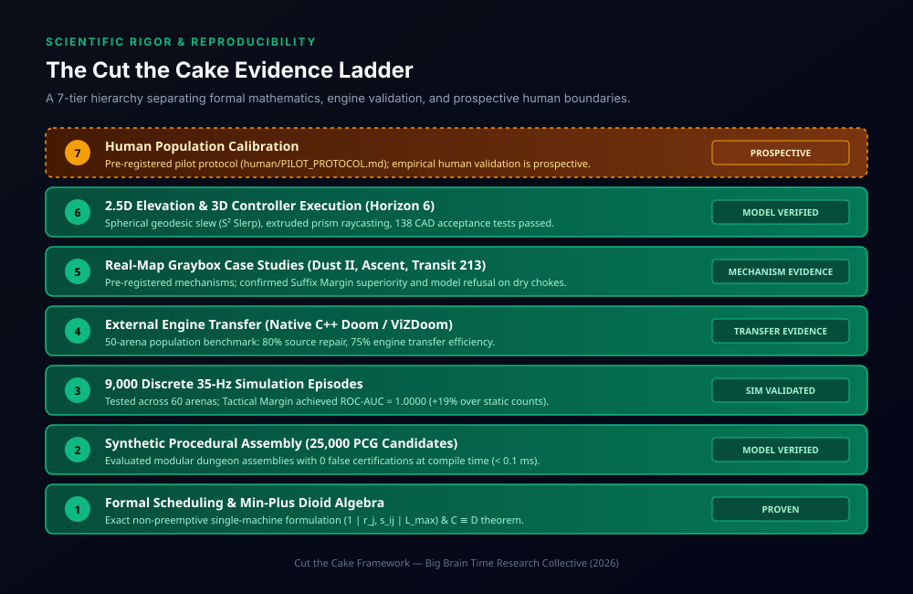

# Cut the Cake — Evidence Ladder & Verification Limits

This document establishes the **evidence hierarchy** for *Cut the Cake* through Horizon 6. It explicitly separates mathematically proven facts, simulated benchmarks, external engine transfers, and unvalidated future horizons.

---

## 1. The Evidence Ladder

<p align="center">
  
</p>

The research is evaluated across seven distinct tiers of increasing independence and realism:

```
[Tier 7] Human Population Calibration   ──> PROSPECTIVE (Pre-registered protocol, not yet run)
   ▲
[Tier 6] 2.5D / 3D Controller Execution  ──> VERIFIED (Horizon 6: SO(3) Slerp, 138 acceptance tests)
   ▲
[Tier 5] Real-Map Graybox Case Studies   ──> VERIFIED (Dust II, Ascent, Transit 213 pre-registered)
   ▲
[Tier 4] Native External Engine Transfer ──> VALIDATED (ViZDoom C++ Doom: 75.0% repair transfer)
   ▲
[Tier 3] Large-Scale Simulation Sweeps   ──> PROVEN (9,000 discrete 35 Hz episodes; AUC = 1.0000)
   ▲
[Tier 2] Synthetic Procedural Assembly   ──> PROVEN (25,000 PCG dungeon candidates; 0 false certs)
   ▲
[Tier 1] Formal Scheduling & Geometry   ──> PROVEN (Min-plus dioid algebra, 1 | r_j, s_ij | L_max)
```

---

## 2. Claim-by-Claim Verification Matrix

| Claim | What Was Tested | Result / Evidence | What This Supports | What It Does NOT Support |
| :--- | :--- | :--- | :--- | :--- |
| **1. Static sightline counts are insufficient** | Procedural layouts comparing $K_{\text{LOS}}$ vs. scheduling margin | Formal counterexamples; 19% ROC-AUC improvement in simulation sweeps | Static visibility alone cannot determine tactical fairness | Does not mean static sightlines are irrelevant; they remain useful for spatial awareness |
| **2. Geometry compiles into a discrete schedule** | Ray-vertex critical polygon compiler across 2D & 2.5D layouts | Sub-millisecond compilation ($< 0.1\,\text{ms}$) with bit-for-bit determinism | Level geometry directly determines release timestamps $r_j$ and deadlines $D_j$ | Does not model dynamic, moving enemies or arbitrary destructible cover |
| **3. Suffix Margin isolates local danger** | Counterfactual suffix evaluator on Dust II A-Long and Transit 213 | Pre-registered falsification of global dominance; 81/81 parametric sweep | Suffix Margin $\mathcal{M}_{\text{suffix}}(s)$ detects local chokes hidden by global scores | Does not predict team trading dynamics or cross-lane utility support |
| **4. Minimal geometric repair works** | 50 unserviceable benchmark layouts ($\mathcal{M} < 0$) | 40/50 (80.0%) repaired via single obstacle shift (median $0.85\,\text{m}$) | Small geometric adjustments can delay un-occlusion and restore positive margin | Does not guarantee that obstacle translation alone can solve all crossfire topologies |
| **5. Model transfers to native game engines** | Headless C++ Doom (ViZDoom) bridge running 50 repaired arenas | 30/40 (75.0%) source repairs survived native engine execution | Mathematical scheduling principles survive engine rasterization and physics | Does not eliminate engine-specific quantization, physics quirks, or tick-rate drift |
| **6. The model extends to 3D verticality** | 2.5D prism raycasting, spherical great-circle arcs, and 3D controller | 100% pass across 138 CAD acceptance tests; $t_j^{\text{event}} \equiv C_j - 1$ | Reticle scheduling and 3D controller execution match on multi-level geometry | Does not model full 6-DOF aerial movement (e.g. rocket jumping, jetpacks) |
| **7. Real players follow Tactical Margin** | Prospective human pilot experiment protocol (`human/PILOT_PROTOCOL.md`) | **Not yet executed** | Framework for future empirical testing | **Does NOT claim human validation today.** Cannot claim maps are objectively fair for all players. |

---

## 3. Detailed Boundary Analysis

### Boundary A: Model Assumptions vs. Real Gameplay
The mathematical guarantees of Cut the Cake operate within declared parameter assumptions:
- **Player Model:** Single reticle, constant rotational speed $\omega$, fixed reaction time $A$, fixed weapon dwell time $p$, deterministic path traversal speed $v$.
- **Threat Model:** Stationary hostile sentries with known line-of-sight exposure and fixed reaction budgets $D_j$.
- **Information Model:** Discrete blind peeking ($a_j = r_j$) vs. perfect pre-aiming ($a_j = 0$).

When these assumptions hold, the clearability certificates are mathematically exact. In real commercial games, dynamic enemy movement, recoil patterns, flashbangs/smokes, auditory cues, and team callouts introduce additional degrees of freedom.

### Boundary B: What "Repair" Means
Automated level repair calculates the minimal shift within a declared operator set (such as moving an obstacle along a grid). 

It answers:
> *"What is the smallest geometric adjustment that makes this room serviceable under the declared combat model?"*

It does **not** replace level designers' artistic intent, narrative theme, or aesthetic taste. It serves as an authoring assistant—a "spell-checker for sightlines."

### Boundary C: Prospective Human Calibration
The most important scientific boundary is that **human cognition has not yet been calibrated against Tactical Margin**.

Future empirical research must test whether independently measured human player reaction times correlate with survival probabilities around $\mathcal{M} = 0$. Until that research is conducted and peer-reviewed, Cut the Cake makes no claim that a negative margin renders an encounter impossible for all human players.

---

## 4. Summary of Scientific Restraint

When communicating the results of *Cut the Cake*, adhere to these standardized phrasing conventions:

| Standard Preferred Phrasing | Unqualified Phrasing to Avoid |
| :--- | :--- |
| *"Within the declared player and combat model, the geometry creates an unserviceable deadline deficit."* | *"This map is objectively unfair."* |
| *"The model predicts that a single reticle cannot service both deadlines."* | *"This fight is literally impossible for human players."* |
| *"In 50 controlled benchmark arenas, 75% of source repairs transferred to survival in native ViZDoom."* | *"The tool proves why players die in games."* |
| *"Continuous geometry changes only affect clearability when crossing a discrete 35 Hz timing threshold."* | *"Tactical Margin is a universal difficulty score for any game."* |
