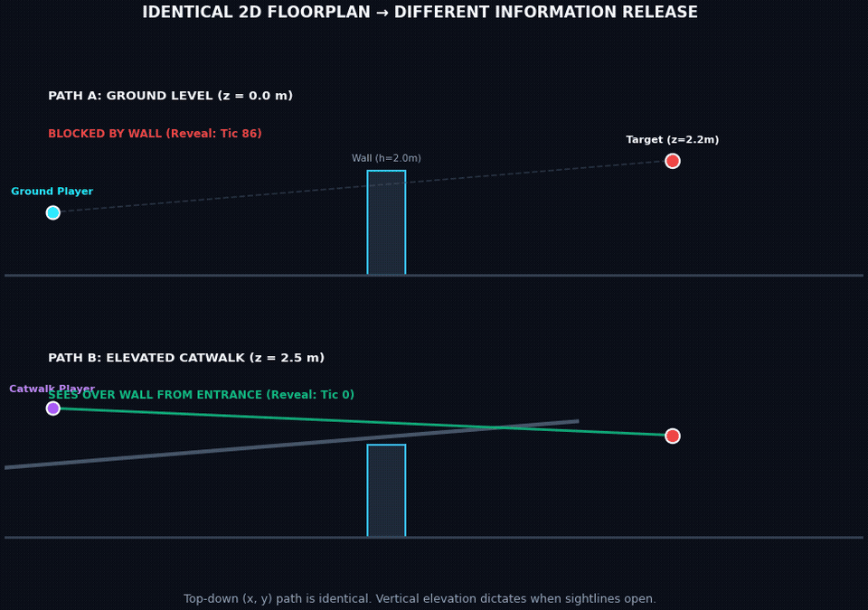

# Cut the Cake — One-Page Overview for People Who Do Not Play Video Games

## The Simple Idea

Imagine walking into a room where three alarms start ringing at once. Each alarm has a strict deadline before it causes a problem, and you can only deal with one at a time.

Even if you are very fast, some arrangements are physically impossible: by the time you reach the first alarm and turn to the second, its deadline has already passed.

**Cut the Cake** asks whether the architectural shape of a virtual space creates this exact kind of bottleneck.

In a first-person competitive game, a player moves through a 3D environment while controlling a single crosshair (the aiming reticle). Walls, doorways, pillars, and elevation determine when different threats become visible. Because the player can only point the crosshair in one direction at a time, turning between directions takes time.

A room is therefore not just a static picture. As a person moves through it, **the architecture creates a dynamic schedule of time-sensitive tasks**.

---

## Why That Is Interesting

Most software tools that analyze architectural spaces or video game levels ask questions such as:
- Can the player physically reach the exit?
- Do any walls overlap?
- Is the floor walkable?
- How much total area is visible from this spot?

Those checks are necessary, but they miss a critical question:

> **Does the geometry reveal information at a rate that a single human decision-maker can actually process?**

  

Cut the Cake models each newly visible threat as a scheduling job:
1. **Release time ($r_j$):** When the threat first becomes visible around a corner.
2. **Deadline ($D_j$):** When the threat will react and fire back.
3. **Processing work ($p_j$):** Time required to recognize, confirm, and neutralize the threat.
4. **Switching cost ($s_{ij}$):** Time required to rotate the crosshair from one angle to another.

The system then asks the classic operations research question:
*Can one processor finish all of these jobs before their deadlines expire?*

Here, the "processor" is the player's single aiming reticle.

---

## The Surprising Result

The intuitive assumption is that a space is dangerous when too many threats are visible at once.

Two rooms can expose the exact same number of threats—or even fewer threats—and produce the opposite of what human intuition expects:
- **Room A (3 Enemies):** Three threats are visible at once. But generous deadlines allow one player to clear all three comfortably ($\mathcal{M} = +65\text{ tics}$).
- **Room B (2 Enemies):** Only two threats are present. But their simultaneous reveal with tight deadlines makes the room mathematically impossible to solve dry ($\mathcal{M} = -29\text{ tics}$).

  

> **The decisive property is not simply how much you see. It is how the geometry releases information over time.**
> **Threat count is not workload. Timing is.**

The project formalizes the remaining safety cushion as **Tactical Margin ($\mathcal{M}$)**:
- **$\mathcal{M} \ge 0$ (Positive Margin):** The modeled player has time left over.
- **$\mathcal{M} < 0$ (Negative Margin):** At least one deadline is mathematically missed.

---

## What the Project Has Demonstrated

Cut the Cake has been validated through several increasingly rigorous, independent layers:
1. **Mathematical Counterexamples:** Proving why raw sightline counts fail to predict clearability.
2. **Procedural Level Sweeps:** Evaluating 25,000 algorithmic layouts with zero false safety certificates.
3. **9,000 Simulated Clearing Episodes:** Testing automated controllers across diverse geometric configurations.
4. **Independent Game Engine Transfer:** Validating a 50-layout repair benchmark inside the native C++ Doom (ViZDoom) engine.
5. **Real-Map-Shaped Case Studies:** Evaluating geometry inspired by *Counter-Strike* (Dust II), *Valorant* (Ascent), and *Call of Duty* (Modern Warfare 4 Transit).
6. **Height-Aware 2.5D/3D Extension:** Modeling elevation, multi-level platforms, finite-height barriers, spherical aiming arcs, and deterministic controller execution.

  

### Automatic Repair in Action
When a layout creates an unserviceable timing conflict, the system can locate the specific obstacle causing the simultaneous reveal and calculate a minimal fix.

In one canonical benchmark room, **sliding a single barrier by just 1.10 meters** converts the encounter from a six-step deadline failure ($\mathcal{M} = -6$) into a comfortable two-step reserve ($\mathcal{M} = +2$).

  

The tool establishes a clear causal chain:
$$\text{Move barrier } 1.10\,\text{m} \implies \text{Threat B delayed} \implies \text{Player finishes Threat A} \implies \text{Deadline met}$$

---

## What It Does Not Prove

Cut the Cake is **not yet a calibrated model of real human populations**.

It does not claim that every human player will succeed when the margin is positive, or fail when it is negative. Real players bring anticipation, teamwork, sound cues, tactical equipment, and varying motor skills.

The formal claim is bounded:
> **Given declared, transparent assumptions about movement speed, reaction time, aim velocity, and threat timing, physical geometry can be compiled into an exact time-sensitive workload, diagnosed, mathematically repaired, and executed.**

  

---

## Why This Matters Beyond Games

Physical and virtual environments constantly control the flow of information.

Whether designing emergency egress corridors, industrial control rooms, airport security checkpoints, or autonomous vehicle navigation interfaces, geometry dictates **when** information reaches a human decision-maker and whether that information arrives faster than human attention can process it.

Games serve as the ideal laboratory for studying this principle because space, movement, deadlines, and outcomes can all be measured with millisecond precision.
