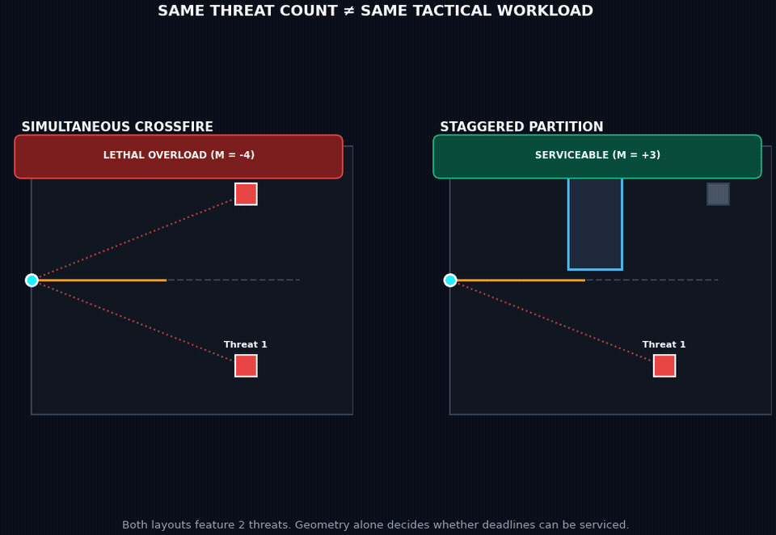

# Cut the Cake — What We Actually Discovered

This document provides a plain-language scientific synthesis of the *Cut the Cake* research project through Horizon 6. 

It is organized chronologically around our **intellectual discoveries and empirical falsifications**—including assumptions that broke under testing—rather than around internal engineering sprints.

---

## 1. The Original Intuition Was Right, But for the Wrong Reason

The starting intuition was familiar to any experienced first-person shooter player:
> *"Good corner clearing lets you isolate angles. Bad geometry exposes you to too many enemies at once."*

The first obvious mathematical hypothesis was to count visible threats at every step along a path ($K_{\text{LOS}}$).

Across tens of thousands of procedurally generated rooms, **static visibility counts consistently failed**:
- They approved layouts where threats appeared with overlapping deadlines that no single reticle could clear in time (**false positives**).
- They rejected layouts where multiple threats were visible at once, but where the physical geometry naturally staggered the reaction deadlines so that both could be cleared safely (**false negatives**).

  

> **Discovery 1:** Tactical difficulty is not a static property of how much you see. It is an emergent property of the **time sequence** in which visibility events occur.

---

## 2. Geometry Behaves Like an Information-Release Mechanism

As a player traverses an environment, walls, corners, and doorways un-occlude threats at discrete timestamps.

In the language of computer science and operations research, these timestamps behave as **release times ($r_j$)** in a real-time scheduling problem. Each threat also imposes a hostile firing deadline ($D_j$).

Because the player possesses only a single aiming reticle:
- Only one target can be processed at a time (a single-machine processor).
- Rotating the crosshair between two directions takes physical time (a sequence-dependent setup cost $s_{ij} = \Delta\theta / \omega$).

$$\text{Geometry } \mathcal{G} \implies \text{Release Times } r_j \implies \text{Deadlines } D_j \implies \text{Reticle Slew } s_{ij} \implies \text{Feasibility}$$

  

> **Discovery 2:** A tactical transition can be compiled into a deadline-constrained, sequence-dependent scheduling problem on a stateful single resource: the player's reticle ($1 \mid r_j, s_{ij} \mid L_{\max}$).

---

## 3. "Slicing the Pie" Is Really About Sequencing Information

Tactical doctrine in law enforcement and gaming advises players to "slice the pie" (pieing a corner) by taking a wide radial arc around a doorway.

Our mathematical compiler proved why this works:
- Hugging the doorway wall releases multiple enemy angles almost simultaneously ($\Delta r \to 0$), collapsing into an unmanageable crossfire.
- Backing away from the corner and moving along an outer arc spreads the un-occlusion timestamps apart in time ($\Delta r \gg 0$).

> **Discovery 3:** The tactical value of a corner is not merely line-of-sight occlusion. It is the ability of the corner to **serialize information releases over time**.

---

## 4. One Global Route Score Can Hide a Terrible Local Choke

We initially hoped that calculating a single, whole-route Tactical Margin ($\mathcal{M} = -L^*$) would naturally rank routes from safest to most dangerous.

When we evaluated real-map-shaped gray-boxes, **that assumption broke**:
- In our Counter-Strike *Dust II* A-Long case study, an aggressive wide swing across the open choke had a higher global score than the methodical pieing route because the wide swing had shorter total travel time and favorable exit angles. Yet during the decisive 2-meter approach interval, the pieing route was strictly superior, isolating the corner defender 47 tics (1.34 s) before exposing the pit defender.
- In *Call of Duty Modern Warfare 4* (Transit 213), an open parking lot sprint looked deceptively good on whole-route metrics, while weaving through the bus lattice was dramatically safer through the dangerous mid-lane section.

  

> **Discovery 4:** A single global score is insufficient. A route requires three distinct, unmixed layers:
> 1. **LOS Exposure ($K_{\text{LOS}}$):** Instantaneous visible threat count.
> 2. **Original-Clock Deadline Headroom ($\delta_{\text{min}}$):** Slack before active deadlines expire.
> 3. **Suffix Tactical Margin ($\mathcal{M}_{\text{suffix}}(s)$):** The counterfactual schedulability of the remaining encounter from position $s$ to the goal.
>
> **Important Falsification:** *"The route with the better global Tactical Margin is always the locally safer route."* — **False.**

---

## 5. The Model Can Correctly Refuse to Invent a Solution

A robust diagnostic model must be capable of declaring that an encounter has no valid solution under the declared rules.

In our *Dust II* Upper B-Tunnels exit case study (an expected-negative benchmark):
- Players exiting the narrow tunnel face an immediate, compressed multi-angle crossfire upon crossing the threshold.
- The model evaluated both left-hugging and right-hugging exit paths and verified that both suffered immediate negative margin ($\mathcal{M}_{\min} = -7$).
- The algorithm did not hallucinate a magical gunplay solution where physical geometry made simultaneous exposure inevitable.

Similarly, in our 50-arena inverse repair benchmark, the optimizer proved that 10/50 layouts could not be repaired using pure obstacle translations alone, correctly identifying when alternative tactical operators (like smoke or flashbang utility) are mandatory.

> **Discovery 5:** Failure to find a solution is an essential scientific capability. When operator sets are frozen in advance, a verified model must be able to say "no."

---

## 6. Small Geometry Changes Can Cross Discrete Timing Boundaries

The simulation operates on a standard 35-Hz game clock (a discrete time step $\Delta t \approx 28.57\,\text{ms}$).

Continuous geometric adjustments ultimately map into discrete integer time tics:

### The Threshold Effect (Canonical Repair)
In our canonical Family 1 obstacle repair fixture, translating a single partition by **1.10 meters** delays the line-of-sight un-occlusion of Threat 2 by 8 tics, shifting the overall encounter from a lethal deficit ($\mathcal{M} = -6$) to a safe reserve ($\mathcal{M} = +2$).

  

### The Quantization Null (Ascent Height Experiment)
Conversely, in our *Valorant* Ascent A-Site elevation sweep, raising an elevated target altered the continuous pitch angle by $+5.35^\circ$. However, because the player's modeled reticle speed can traverse up to $10.29^\circ$ per tic, the angular work remained within the same 1-tic bucket. The discrete schedule and Tactical Margin remained identically unchanged.

> **Discovery 6:** Continuous geometric change does not imply continuous tactical change. A physical edit only alters tactical clearability if it crosses a discrete **timing boundary** on the simulation clock.

---

## 7. Height Changes Information Even When the Floorplan Is Identical

In Horizon 6, we expanded the system from 2D planar maps to 2.5D extruded geometry with finite-height obstacles, elevated platforms, and 3D waypoints.

To isolate the impact of verticality, we constructed two routes that shared the exact same top-down $(x, y)$ coordinates:
- A ground-level player path was blocked by a finite-height partition until reaching tic 86.
- An elevated ramp player path looked over the top of the barrier and acquired line-of-sight at tic 0.

  

> **Discovery 7:** Two routes with identical 2D floorplans can produce entirely different information-release schedules due to vertical occluder geometry.

---

## 8. The Scheduler Extends Naturally from 2D to Spherical Aiming

When aiming in 3D, reticle orientation is a point on the unit sphere $(\theta, \phi)$ representing azimuth and elevation.

We upgraded the setup cost calculation from simple 1D circular angles to **spherical great-circle geodesic distances**:
$$\Delta \alpha_{ij} = \arccos(\operatorname{clamp}(\sin \phi_i \sin \phi_j + \cos \phi_i \cos \phi_j \cos(\theta_i - \theta_j), -1.0, 1.0))$$

Crucially, when all elevations are zero ($\phi_i = \phi_j = 0^\circ$), this formula simplifies with bit-for-bit mathematical identity back to our original 2D circular model.

> **Discovery 8:** The single-machine scheduling abstraction is not limited to 2D planes. It generalizes seamlessly to $\mathrm{SO}(3)$ spherical aim dynamics while strictly preserving the 2D foundation as a special case.

---

## 9. The Discrete Schedule Actually Executes in Continuous 3D

In Horizon 6-C, we implemented a 3D simulation controller that rotates the reticle along spherical geodesic arcs using spherical linear interpolation (Slerp) at 35 Hz.

In multi-threat 3D combat fixtures:
- The controller navigated the 3D route, acquired targets, and emitted physical `SERVICE_COMPLETE` execution events.
- Across all test configurations, the realized event timestamps **matched the discrete scheduler's predicted completion tics identically** ($t_j^{\text{event}} \equiv C_j - 1$).

> **Discovery 9:** Tactical Margin is not just an abstract theoretical number; it is an **executable contract**. A deterministic 3D agent physically executes the exact schedule derived from geometry.

---

## 10. Source-Model Correctness Does Not Guarantee Engine Transfer

To test how well the mathematical model survives outside its own simulation environment, we exported 50 broken arenas and their proposed repairs into **ViZDoom** (a native C++ implementation of the *Doom* engine):
- **40 / 50 (80.0%)** layouts were successfully repaired in our source model.
- **30 / 50 (60.0%)** produced a complete death-to-survival rescue inside native ViZDoom.
- **30 / 40 (75.0%)** of source repairs transferred successfully to native engine survival.

When we decomposed the failures, we discovered that transfer gaps were caused by engine-specific line-of-sight rasterization, collision bounding boxes, and WAD coordinate quantization.

> **Discovery 10:** A tactical certificate requires a **deployment guard band** when exported to third-party game engines to absorb physics and geometric quantization differences.

---

## 11. The Research Produced a New Kind of Design Tool: Tactical CAD

By combining geometry compilation, discrete scheduling, and spatial diagnosis, Cut the Cake enables a closed-loop design workflow:
1. **Author** gray-box level geometry.
2. **Compile** information-release schedules and Suffix Margins in real time ($< 0.1\,\text{ms}$).
3. **Diagnose** the exact wall or obstacle causing a deadline breach.
4. **Synthesize** a minimal geometric shift (e.g., $+1.10\,\text{m}$) that restores positive margin.
5. **Replay** and verify the scenario before and after the edit.

  

> **Discovery 11:** Level geometry can be linted, analyzed, and repaired with the same mathematical rigor that compilers apply to source code.

---

## Summary: What Is Novel vs. What Remains to Be Done

  

### What Cut the Cake Demonstrates
Path-conditioned level geometry can be compiled into a sequence-dependent, deadline-constrained scheduling problem on a single aiming reticle, supporting exact feasibility certificates, spatial heatmaps, inverse geometric repair, and 3D controller execution.

### What Has Not Yet Been Proven
Cut the Cake has **not yet been calibrated against human population data**. 

We have not proven that human players with measured reaction times will succeed or fail at the exact zero-margin boundary. Factors such as sound cues, team coordination, visual distraction, and utility equipment remain outside the current model.

The next scientific milestone for the project is empirical human calibration: measuring player sensorimotor capabilities independently and testing whether Tactical Margin predicts human survival on unseen encounters.
